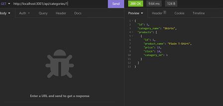

# E-Commerce-Back-End

## Description

This is an example of backend database management!

## Features

You are able to view the contents of each category (category, product, tag) as well as add and delete
new items to each.

## Installation

Run npm install to install the required packages.

## Demo Video

<a href="https://www.youtube.com/watch?v=sSkM45a96-Y">YouTube Video Demonstration</a>

## Links

<a href="https://vilas-izquierdo.github.io/E-Commerce-Back-End/">Deployed Page</a>

<a href="https://github.com/vilas-izquierdo/E-Commerce-Back-End">GitHub</a>
